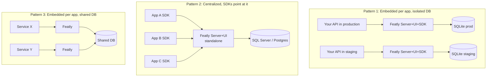
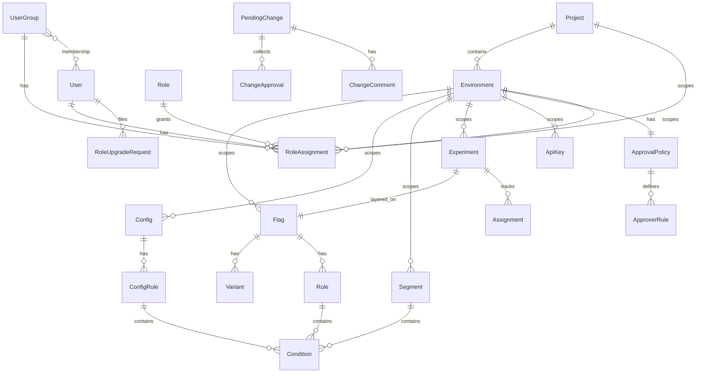
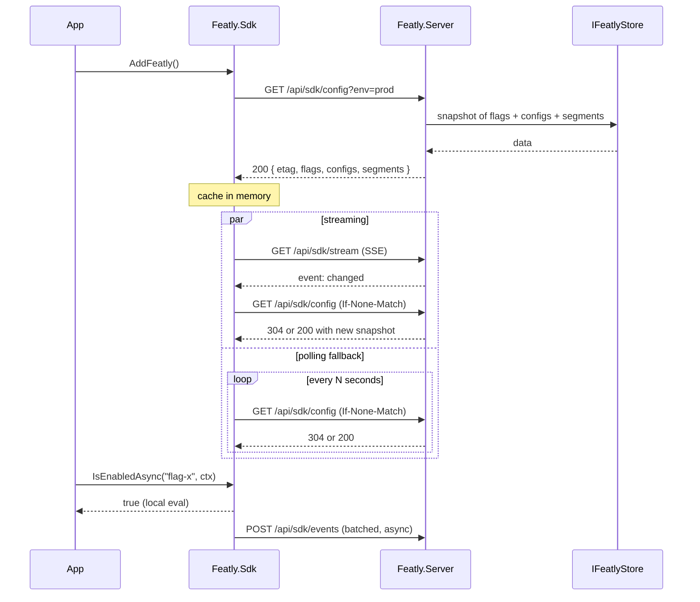

# Featly — Architecture

> Open-source feature management platform for .NET. Feature flags, dynamic configuration, segments, experiments, A/B testing, and enterprise governance (custom RBAC, approval workflows, audit). Embed it inside your ASP.NET Core application like Hangfire, or host it centrally for many consumers. Bring your own database.

**Status:** Living design document
**Target runtime:** .NET 10 (server + UI), .NET 8 + .NET 10 (SDK, multi-target)
**License (proposed):** MIT

---

## 1. Vision and principles

Featly is what you get when you combine the developer experience of Hangfire (embedded server + UI + SDK in your own application process) with the engine model of LaunchDarkly / Unleash (local evaluation in the SDK, server provides configuration) and the governance posture of an enterprise platform (custom roles, approval workflows, audit, settings precedence). It is the first project in the .NET open-source space to bring all three together.

**Core principles**

- **Local-first evaluation.** The SDK evaluates flags and configs locally against a cached, fresh-by-default snapshot of the configuration. There is no network call on the hot path. Decisions take microseconds.
- **Embedded like Hangfire.** The server, the dashboard, and the SDK all run inside your ASP.NET Core process if you want them to. Two registration calls and a middleware mount are enough to be operational. Self-hosted central deployments are equally supported using the same code paths.
- **OpenFeature is a first-class citizen.** Featly ships a `Featly.OpenFeature.Provider` package on day one. You can adopt OpenFeature without leaving Featly, and you can adopt Featly without abandoning OpenFeature.
- **Storage is an interface.** `IFeatlyStore` is the contract. SQLite and in-memory providers ship first; SQL Server, PostgreSQL, and Redis follow. Migrations are EF Core.
- **DB beats config.** Settings have a three-layer precedence: hardcoded default, `appsettings.json`, then database. Anything editable in the UI lives in the database and overrides `appsettings`.
- **Predictable, not magical.** Small APIs, explicit contracts, no compile-time reflection tricks. No required source generators. Everything you can do in the UI you can also do via the HTTP API.
- **Resilient by default.** The SDK serves the last known good configuration if the server is unreachable. Bootstrap from a static JSON file is supported for cold starts in air-gapped or serverless environments.

---

## 2. Deployment patterns

The same binary supports three deployment patterns. The database schema is identical across them; the difference is operational.



### Pattern 1 — Embedded per app, isolated DB

Each deployment of your application embeds Featly Server, Dashboard, and SDK in the same process. Each instance points at its own database (SQLite by default). Within that instance you have one Project (auto-created at boot, named after the application) and one Environment (auto-named from `IHostEnvironment.EnvironmentName`). The dashboard hides the Project and Environment selectors when only one of each exists. This is the Hangfire-style experience and the recommended starting point for small teams.

### Pattern 2 — Centralized, SDKs point at it

A single Featly server (standalone process or embedded in a "control plane" app) backed by a shared database (SQL Server or PostgreSQL is typical here). Application services run only the SDK and point at the central server with API keys scoped per environment. The dashboard surfaces all projects and environments. This is the LaunchDarkly / Unleash operational model.

### Pattern 3 — Embedded per app, shared DB

Multiple applications embed Featly and point at the same database. The Project concept separates concerns: each service owns a Project, so feature keys cannot collide and access control can be scoped. This works because the data model treats Project as first-class from day one.

The Featly architecture does not require you to commit to one pattern. You can start with Pattern 1 (zero-friction), move to Pattern 2 when you want a single pane of glass, and combine with Pattern 3 if some services prefer autonomy.

---

## 3. Solution structure

Eleven projects, three logical layers (contracts → engine → integration), plus storage providers and tooling.

```
src/
  Featly.Abstractions/            # Interfaces, models, contracts. Zero dependencies.
  Featly.Engine/                  # Evaluation engine, rule matching, hashing.
  Featly.Sdk/                     # Client SDK: local-eval cache, HTTP sync, event batching.
  Featly.AspNetCore/              # DI extensions, ambient EvaluationContext from HttpContext.
  Featly.OpenFeature.Provider/    # Provider adapter for the OpenFeature spec.
  Featly.Server/                  # Admin and SDK HTTP APIs, approval engine, webhook dispatch.
  Featly.Dashboard/               # Embedded UI, served from middleware as static resources.
  Featly.Storage.Abstractions/    # IFeatlyStore facade and sub-store contracts.
  Featly.Storage.InMemory/        # In-memory store, for tests and demos.
  Featly.Storage.Sqlite/          # SQLite store via EF Core.
  Featly.Cli/                     # dotnet tool for migrations, locks, import/export.
tests/
  Featly.Engine.Tests/
  Featly.Sdk.Tests/
  Featly.Server.Tests/            # WebApplicationFactory-based integration tests.
  Featly.Storage.Sqlite.Tests/
  Featly.E2E.Tests/               # Full-stack: server + SDK in process, end-to-end sync.
samples/
  WebApi.Sample/                  # Consumer: ASP.NET Core API using Featly.Sdk.
  SelfHosted.Sample/              # Hosts server + UI + storage in one app.
docs/
  ARCHITECTURE.md                 # This document.
  GETTING_STARTED.md
  CONFIGURATION.md
  adr/                            # Architectural Decision Records.
```

**Key dependency rules.** `Featly.Sdk` is light: no EF Core, no server code, just HTTP client + `Featly.Engine` + `Featly.Abstractions`. `Featly.Engine` is shared between SDK and Server, so client and server evaluate the same way by construction. `Featly.Server` does not depend on `Featly.Sdk` (the server is not a client of itself). Storage providers are independent packages so consumers pay only for what they use.

**Targeting.** `Featly.Abstractions`, `Featly.Engine`, `Featly.Sdk`, `Featly.AspNetCore`, and `Featly.OpenFeature.Provider` multi-target `net8.0;net10.0`. The server, dashboard, storage providers, and CLI target `net10.0` only — you control the .NET version of the host process.

### Published NuGet packages

| Package | Audience | Contains |
|---|---|---|
| `Featly.Sdk` | Consumers that only need a client | Abstractions + Engine + SDK |
| `Featly.AspNetCore` | ASP.NET Core consumers | SDK + DI/middleware integration |
| `Featly.OpenFeature.Provider` | Teams adopting OpenFeature | Provider wrapping `IFeatlyClient` |
| `Featly` *(meta)* | Self-hosters | Server + Dashboard + Storage.Sqlite |
| `Featly.Server` | Custom setups | Server only |
| `Featly.Dashboard` | Custom setups | Dashboard only |
| `Featly.Storage.Sqlite` | Self-hosters needing SQLite | SQLite provider |
| `Featly.Storage.InMemory` | Tests, demos | In-memory provider |

---

## 4. Domain model

Featly's persistent state is modeled as **twenty-five entities** organized into eight groups. The diagram below shows the high-level relationships; the entities are detailed in the sections that follow.



### 4.1 Feature core (six entities)

```csharp
public sealed class Flag
{
    public Guid Id { get; init; }
    public required string Key { get; init; }              // unique per environment
    public required string Name { get; set; }
    public string? Description { get; set; }
    public FlagType Type { get; set; }                     // Boolean | String | Number | Json
    public bool Enabled { get; set; }                      // global kill switch
    public required string DefaultVariantKey { get; set; } // fallback when no rule matches
    public List<Variant> Variants { get; set; } = [];
    public List<Rule> Rules { get; set; } = [];            // ordered, first-match-wins
    public required Guid EnvironmentId { get; init; }
    public List<string> Tags { get; set; } = [];
    public bool Archived { get; set; }
    public DateTimeOffset CreatedAt { get; init; }
    public DateTimeOffset UpdatedAt { get; set; }
    public string CreatedBy { get; init; } = "";
    public string UpdatedBy { get; set; } = "";
}

public enum FlagType { Boolean, String, Number, Json }

public sealed class Variant
{
    public required string Key { get; init; }     // "on", "off", "control", "treatment-a"
    public required string Name { get; set; }
    public string? Description { get; set; }
    public required JsonElement Value { get; set; }   // typed by Flag.Type
}

public sealed class Rule
{
    public Guid Id { get; init; }
    public int Order { get; set; }                          // evaluation precedence
    public string? Name { get; set; }
    public List<Condition> Conditions { get; set; } = [];   // AND between conditions
    public required RuleOutcome Outcome { get; set; }
    public bool Enabled { get; set; } = true;
}

public sealed class Condition
{
    public required string Attribute { get; set; }    // "user.country", "user.plan", "request.ip"
    public required ConditionOperator Operator { get; set; }
    public required JsonElement Value { get; set; }
    public bool Negate { get; set; }                  // optional NOT wrapper
}

public enum ConditionOperator
{
    Equals, NotEquals,
    In, NotIn,
    GreaterThan, GreaterThanOrEqual, LessThan, LessThanOrEqual,
    Contains, StartsWith, EndsWith,
    Matches,                       // regex
    SemverGt, SemverLt, SemverEq,
    InSegment                      // Value is a Segment key
}

public sealed class RuleOutcome
{
    // exactly one of the two is set:
    public string? VariantKey { get; set; }       // serve this variant
    public List<Split>? Splits { get; set; }      // bucket by weights
}

public sealed class Split
{
    public required string VariantKey { get; init; }
    public required int Weight { get; init; }     // weights in a rule sum to 100
}
```

### 4.2 Dynamic configuration (two entities)

Configs share the targeting engine with flags but produce typed values directly instead of selecting variants.

```csharp
public sealed class Config
{
    public Guid Id { get; init; }
    public required string Key { get; init; }
    public required string Name { get; set; }
    public string? Description { get; set; }
    public required ConfigType Type { get; set; }
    public required JsonElement DefaultValue { get; set; }
    public List<ConfigRule> Rules { get; set; } = [];
    public required Guid EnvironmentId { get; init; }
    public List<string> Tags { get; set; } = [];
    public bool Archived { get; set; }
    public DateTimeOffset CreatedAt { get; init; }
    public DateTimeOffset UpdatedAt { get; set; }
    public string CreatedBy { get; init; } = "";
    public string UpdatedBy { get; set; } = "";
}

public enum ConfigType { String, Int, Long, Double, Decimal, Bool, DateTime, TimeSpan, Json }

public sealed class ConfigRule
{
    public Guid Id { get; init; }
    public int Order { get; set; }
    public string? Name { get; set; }
    public List<Condition> Conditions { get; set; } = [];   // same Condition as flags
    public required JsonElement Value { get; set; }         // direct value, no variant indirection
    public bool Enabled { get; set; } = true;
}
```

### 4.3 Reusable targeting (one entity)

```csharp
public sealed class Segment
{
    public Guid Id { get; init; }
    public required string Key { get; init; }
    public required string Name { get; set; }
    public string? Description { get; set; }
    public List<Condition> Conditions { get; set; } = [];   // AND between conditions
    public required Guid EnvironmentId { get; init; }
    public DateTimeOffset CreatedAt { get; init; }
    public DateTimeOffset UpdatedAt { get; set; }
}
```

Segments are referenced from rules via the `InSegment` operator. They let teams maintain audience definitions in one place and reuse them across many flags and configs.

### 4.4 Hierarchical structure (two entities)

```csharp
public sealed class Project
{
    public Guid Id { get; init; }
    public required string Key { get; init; }
    public required string Name { get; set; }
    public string? Description { get; set; }
    public bool IsDefault { get; set; }                    // protects from accidental delete
    public DateTimeOffset CreatedAt { get; init; }
}

public sealed class Environment
{
    public Guid Id { get; init; }
    public required Guid ProjectId { get; init; }
    public required string Key { get; init; }              // "production", "staging"
    public required string Name { get; set; }
    public bool IsDefault { get; set; }
    public bool ReadOnly { get; set; }                     // total lockdown flag
    public DateTimeOffset CreatedAt { get; init; }
}
```

On first boot with an empty database, Featly auto-creates a default Project named after the application (or `"default"`) and a default Environment named after `IHostEnvironment.EnvironmentName`. This makes the embedded quickstart truly zero-friction. The dashboard hides the Project selector when only one Project exists and hides the Environment selector when the active Project has only one Environment.

### 4.5 Experimentation (three entities)

```csharp
public sealed class Experiment
{
    public Guid Id { get; init; }
    public required string Key { get; init; }
    public required string Name { get; set; }
    public string? Hypothesis { get; set; }
    public required Guid FlagId { get; init; }             // experiment layered on a flag
    public List<string> MetricKeys { get; set; } = [];     // event keys tracked
    public bool StickyAssignments { get; set; }            // opt-in persistence
    public DateTimeOffset? StartedAt { get; set; }
    public DateTimeOffset? StoppedAt { get; set; }
    public required Guid EnvironmentId { get; init; }
}

public sealed class Assignment
{
    public Guid Id { get; init; }
    public required Guid ExperimentId { get; init; }
    public required string SubjectKey { get; init; }
    public required string VariantKey { get; init; }
    public DateTimeOffset AssignedAt { get; init; }
}

public sealed class Event
{
    public Guid Id { get; init; }
    public required EventType Type { get; init; }          // Exposure | Custom
    public string? FlagKey { get; init; }
    public string? ConfigKey { get; init; }
    public string? CustomKey { get; init; }
    public required string SubjectKey { get; init; }
    public string? VariantKey { get; init; }
    public Dictionary<string, JsonElement>? Properties { get; init; }
    public required DateTimeOffset At { get; init; }
    public required Guid EnvironmentId { get; init; }
}

public enum EventType { Exposure, Custom }
```

### 4.6 RBAC (five entities)

```csharp
public sealed class User
{
    public Guid Id { get; init; }
    public required string Identifier { get; init; }     // email or sub claim from your IdP
    public required string DisplayName { get; set; }
    public DateTimeOffset CreatedAt { get; init; }
    public DateTimeOffset? LastLoginAt { get; set; }
    public bool Disabled { get; set; }
}

public sealed class Role
{
    public Guid Id { get; init; }
    public required string Key { get; init; }
    public required string Name { get; set; }
    public string? Description { get; set; }
    public bool IsSystem { get; init; }                  // true for the 4 seeded immutable roles
    public List<Permission> Permissions { get; set; } = [];
    public DateTimeOffset CreatedAt { get; init; }
    public DateTimeOffset UpdatedAt { get; set; }
}

public enum Permission
{
    // Flag
    FlagRead, FlagCreate, FlagUpdate, FlagArchive,
    // Config
    ConfigRead, ConfigCreate, ConfigUpdate, ConfigArchive,
    // Segment
    SegmentRead, SegmentCreate, SegmentUpdate, SegmentArchive,
    // Experiment
    ExperimentRead, ExperimentCreate, ExperimentUpdate, ExperimentStart, ExperimentStop,
    // Environment
    EnvironmentRead, EnvironmentCreate, EnvironmentUpdate, EnvironmentLock,
    // Project
    ProjectRead, ProjectCreate, ProjectUpdate,
    // ApiKey
    ApiKeyRead, ApiKeyCreate, ApiKeyRevoke,
    // User
    UserRead, UserCreate, UserUpdateRole, UserDisable,
    // Role and groups
    RoleRead, RoleCreate, RoleUpdate, RoleDelete,
    GroupRead, GroupCreate, GroupUpdate, GroupDelete,
    // Approval policy
    ApprovalPolicyRead, ApprovalPolicyUpdate,
    // Audit
    AuditRead,
    // Webhook
    WebhookRead, WebhookCreate, WebhookUpdate, WebhookDelete,
    // Pending change
    ChangeRead, ChangeCreate, ChangeApprove, ChangeReject, ChangeApply, ChangeBypass,
    // Settings
    SettingsRead, SettingsUpdate
}

public sealed class UserGroup
{
    public Guid Id { get; init; }
    public required string Key { get; init; }
    public required string Name { get; set; }
    public string? Description { get; set; }
    public List<Guid> MemberUserIds { get; set; } = [];
    public DateTimeOffset CreatedAt { get; init; }
    public DateTimeOffset UpdatedAt { get; set; }
}

public sealed class RoleAssignment
{
    public Guid Id { get; init; }
    public required AssigneeType AssigneeType { get; init; }   // User | Group
    public required Guid AssigneeId { get; init; }
    public required Guid ProjectId { get; init; }
    public Guid? EnvironmentId { get; init; }                  // null = all envs in the project
    public required Guid RoleId { get; init; }
    public DateTimeOffset AssignedAt { get; init; }
    public Guid? AssignedByUserId { get; init; }
}

public enum AssigneeType { User, Group }

public sealed class RoleUpgradeRequest
{
    public Guid Id { get; init; }
    public required Guid UserId { get; init; }
    public required Guid TargetProjectId { get; init; }
    public Guid? TargetEnvironmentId { get; init; }            // null = all envs
    public required Guid RequestedRoleId { get; init; }
    public string? Justification { get; set; }
    public RoleUpgradeStatus Status { get; set; }
    public Guid? DecidedByUserId { get; set; }
    public string? DecisionComment { get; set; }
    public DateTimeOffset CreatedAt { get; init; }
    public DateTimeOffset? DecidedAt { get; set; }
}

public enum RoleUpgradeStatus { Pending, Approved, Rejected }
```

System roles are pre-seeded and **immutable**: `Viewer`, `Editor`, `Approver`, `Admin`. To customize, clone a system role as a template and edit the copy. This protects the meaning of well-known role names across deployments.

### 4.7 Approval workflow (five entities)

```csharp
public sealed class PendingChange
{
    public Guid Id { get; init; }
    public required string EntityType { get; init; }      // "Flag" | "Config" | "Segment" | ...
    public required string EntityKey { get; init; }
    public required Guid EnvironmentId { get; init; }
    public required ChangeAction Action { get; init; }    // Create | Update | Archive
    public required JsonElement ProposedState { get; init; }
    public JsonElement? CurrentState { get; init; }       // snapshot for diff
    public required Guid AuthorUserId { get; init; }
    public string? AuthorMessage { get; set; }
    public ChangeStatus Status { get; set; }
    public List<ChangeApproval> Approvals { get; set; } = [];
    public List<ChangeComment> Comments { get; set; } = [];
    public Guid? AppliedByUserId { get; set; }
    public DateTimeOffset? AppliedAt { get; set; }
    public DateTimeOffset? RejectedAt { get; set; }
    public string? RejectionReason { get; set; }
    public bool WasEmergencyBypass { get; set; }
    public DateTimeOffset CreatedAt { get; init; }
    public DateTimeOffset UpdatedAt { get; set; }
}

public enum ChangeAction { Create, Update, Archive }
public enum ChangeStatus { Pending, Approved, Rejected, Applied, Stale }

public sealed class ChangeApproval
{
    public Guid Id { get; init; }
    public required Guid PendingChangeId { get; init; }
    public required Guid ApproverUserId { get; init; }
    public required ApprovalDecision Decision { get; init; }
    public string? Comment { get; set; }
    public DateTimeOffset At { get; init; }
}

public enum ApprovalDecision { Approve, Reject, RequestChanges }

public sealed class ChangeComment
{
    public Guid Id { get; init; }
    public required Guid PendingChangeId { get; init; }
    public required Guid AuthorUserId { get; init; }
    public required string Body { get; init; }
    public DateTimeOffset At { get; init; }
}

public sealed class ApprovalPolicy
{
    public Guid Id { get; init; }
    public required Guid EnvironmentId { get; init; }
    public bool Required { get; set; }
    public int MinApprovals { get; set; } = 1;
    public bool AuthorCanApproveOwnChange { get; set; } = false;
    public bool AllowEmergencyBypass { get; set; } = true;
    public List<ApproverRule> ApproverRules { get; set; } = [];
}

public sealed class ApproverRule
{
    public Guid Id { get; init; }
    public required ApproverRuleType Type { get; init; }   // SpecificUser | AnyFromRole | AnyFromGroup
    public Guid? UserId { get; set; }
    public Guid? RoleId { get; set; }
    public Guid? GroupId { get; set; }
    public bool Mandatory { get; set; }                    // this specific approval must happen
    public int MinFromThisRule { get; set; } = 1;
}

public enum ApproverRuleType { SpecificUser, AnyFromRole, AnyFromGroup }
```

### 4.8 Infrastructure and settings (six entities)

```csharp
public sealed class ApiKey
{
    public Guid Id { get; init; }
    public required string Name { get; set; }
    public required string HashedSecret { get; init; }     // Argon2id
    public required string Prefix { get; init; }           // first 8 chars, shown for ID
    public required Guid EnvironmentId { get; init; }
    public required ApiKeyScope Scope { get; init; }
    public DateTimeOffset CreatedAt { get; init; }
    public DateTimeOffset? RevokedAt { get; set; }
    public DateTimeOffset? LastUsedAt { get; set; }
}

public enum ApiKeyScope { SdkRead, AdminWrite }

public sealed class AuditLog
{
    public Guid Id { get; init; }
    public required string Actor { get; init; }
    public required string Action { get; init; }           // "flag.update", "change.bypassed", etc.
    public required string EntityType { get; init; }
    public required string EntityId { get; init; }
    public JsonElement? Before { get; init; }
    public JsonElement? After { get; init; }
    public required DateTimeOffset At { get; init; }
    public required Guid EnvironmentId { get; init; }
}

public sealed class Webhook
{
    public Guid Id { get; init; }
    public required string Name { get; set; }
    public required string Url { get; set; }
    public required string SecretHash { get; init; }       // for HMAC signing
    public List<string> SubscribedEvents { get; set; } = [];
    public bool Enabled { get; set; }
    public Guid? EnvironmentId { get; set; }               // null = global
    public DateTimeOffset CreatedAt { get; init; }
    public DateTimeOffset? LastDeliveredAt { get; set; }
    public int ConsecutiveFailures { get; set; }
}

// DB-overrides-config settings, modeled as singletons:
public sealed class AuthorizationSettings { /* see Section 11 */ }
public sealed class ApprovalDefaultsSettings { /* see Section 11 */ }
public sealed class WebhookSettings { /* see Section 11 */ }
```

---

## 5. Evaluation engine

The engine lives in `Featly.Engine` and is shared by `Featly.Sdk` (local evaluation in the client) and `Featly.Server` (server-side preview, used by the dashboard's "test this context" feature). Sharing the engine guarantees that client and server reach the same decision for the same inputs.

### Algorithm

```
evaluate(flag, ctx):
    if flag is null or flag.Archived:
        return (defaultValue, NotFound)
    if not flag.Enabled:
        return (variantValue(flag.DefaultVariantKey), Disabled)
    for rule in flag.Rules ordered by Order, where rule.Enabled:
        if all rule.Conditions match ctx:
            if rule.Outcome.VariantKey != null:
                return (variantValue, TargetingMatch, rule)
            else:
                bucket = MurmurHash3(ctx.TargetingKey + ":" + flag.Key + ":" + salt) % 10000
                variant = pickByCumulativeWeight(rule.Outcome.Splits, bucket)
                return (variantValue, Split, rule)
    return (variantValue(flag.DefaultVariantKey), Default)
```

**Conditions within a rule are joined with AND. Rules are first-match-wins in the order specified.** Any logic representable by Boolean expressions flattens into N rules. There is no nested AST. This matches LaunchDarkly and Unleash and is what users intuitively expect from the visual editor.

### Hashing

Bucketing uses **MurmurHash3** (128-bit, truncated to 32 bits) over `targetingKey + ":" + flagKey + ":" + salt`. Determinism is by construction: the same subject receives the same variant as long as weights do not change. When weights change, some subjects migrate. For experiments where migration is unacceptable, `Experiment.StickyAssignments = true` persists the first exposure in an `Assignment` row, and subsequent evaluations read the persisted variant.

### Configs share the same path

Config evaluation reuses the same rule-matching logic. The only difference is the outcome shape: `ConfigRule.Value` is the typed value directly instead of selecting a variant. This is what allows configs to have full targeting (Option B in the design discussion) without duplicating engine code.

---

## 6. SDK

The SDK exposes a segmented API: separate clients for flags, configs, and events.

```csharp
public interface IFeatlyClient
{
    IFlagClient Flags { get; }
    IConfigClient Configs { get; }
    IEventClient Events { get; }
}

public interface IFlagClient
{
    ValueTask<bool> IsEnabledAsync(string key,
        EvaluationContext? ctx = null, CancellationToken ct = default);

    ValueTask<T> GetVariantAsync<T>(string key, T defaultValue,
        EvaluationContext? ctx = null, CancellationToken ct = default);

    ValueTask<EvaluationResult<T>> EvaluateAsync<T>(string key, T defaultValue,
        EvaluationContext? ctx = null, CancellationToken ct = default);
}

public interface IConfigClient
{
    ValueTask<T> GetAsync<T>(string key, T defaultValue,
        EvaluationContext? ctx = null, CancellationToken ct = default);

    ValueTask<EvaluationResult<T>> EvaluateAsync<T>(string key, T defaultValue,
        EvaluationContext? ctx = null, CancellationToken ct = default);
}

public interface IEventClient
{
    ValueTask TrackAsync(string eventKey,
        EvaluationContext? ctx = null,
        IReadOnlyDictionary<string, object?>? properties = null,
        CancellationToken ct = default);
}

public sealed record EvaluationContext(
    string? TargetingKey = null,
    IReadOnlyDictionary<string, object?>? Attributes = null);

public sealed record EvaluationResult<T>(
    string Key,
    T Value,
    string VariantKey,
    EvaluationReason Reason,
    string? RuleMatched = null,
    string? Error = null);

public enum EvaluationReason
{
    Static, TargetingMatch, Split, Default, Disabled, Error, NotFound
}
```

### Ambient context with explicit override

Building an `EvaluationContext` on every call is tedious. Featly follows the `Microsoft.FeatureManagement` pattern: register an `IFeatlyContextAccessor` in DI (a default ASP.NET Core implementation reads `HttpContext.User` and claims), and the SDK pulls the context automatically. Explicit context is always an option for override.

```csharp
// Once at startup:
builder.Services.AddFeatly()
    .UseServer("https://features.mycompany.com", apiKey: "...")
    .UseContextAccessor<HttpContextFeatlyContextAccessor>();

// In application code, ambient:
if (await featly.Flags.IsEnabledAsync("new-checkout-flow"))
    return Results.Ok(new { ui = "v2" });

// Or explicit:
var ctx = new EvaluationContext(
    TargetingKey: User.Id,
    Attributes: new Dictionary<string, object?> { ["plan"] = "pro" });
if (await featly.Flags.IsEnabledAsync("new-checkout-flow", ctx))
    return Results.Ok(new { ui = "v2" });
```

### Synchronization with the server



### Resilience

The in-memory cache survives server outages. Optional on-disk cache survives application restarts when the server is unreachable. Cold-start bootstrap from a static JSON file is supported for air-gapped or serverless environments. After repeated failures, the client backs off exponentially before retrying.

---

## 7. Storage layer

`IFeatlyStore` is a **facade with nineteen sub-stores**, one per entity group, plus a transaction boundary and a change notifier.

```csharp
public interface IFeatlyStore
{
    IFlagStore Flags { get; }
    IConfigStore Configs { get; }
    ISegmentStore Segments { get; }
    IProjectStore Projects { get; }
    IEnvironmentStore Environments { get; }
    IApiKeyStore ApiKeys { get; }
    IExperimentStore Experiments { get; }
    IEventSink Events { get; }
    IAuditLogStore Audit { get; }
    IPendingChangeStore PendingChanges { get; }
    IApprovalPolicyStore ApprovalPolicies { get; }
    IUserStore Users { get; }
    IRoleStore Roles { get; }
    IUserGroupStore Groups { get; }
    IRoleAssignmentStore RoleAssignments { get; }
    IRoleUpgradeRequestStore RoleUpgradeRequests { get; }
    IWebhookStore Webhooks { get; }
    ISystemSettingsStore Settings { get; }
    IChangeNotifier Changes { get; }                    // emits to SSE

    Task<IAsyncDisposable> BeginTransactionAsync(CancellationToken ct);
}

public interface IFlagStore
{
    Task<Flag?> GetAsync(Guid environmentId, string key, CancellationToken ct);
    Task<IReadOnlyList<Flag>> ListAsync(Guid environmentId, CancellationToken ct);
    Task UpsertAsync(Guid environmentId, Flag flag, string actor, CancellationToken ct);
    Task ArchiveAsync(Guid environmentId, string key, string actor, CancellationToken ct);
}
// IConfigStore, ISegmentStore, ... follow the same shape
```

The facade pattern keeps DI registration simple (one `IFeatlyStore`), preserves the Interface Segregation Principle (each sub-store is small and mockable), and provides a natural place for transactions.

### EF Core internal

The `FeatlyDbContext` is `internal` to `Featly.Storage.Sqlite`. Consumers never depend on EF Core directly — they only see `IFeatlyStore` and its sub-stores. This protects the public API against future internal evolution; we could swap EF Core for Dapper or hand-rolled SQL without breaking consumers.

### Migrations

EF Core migrations live in `Featly.Storage.Sqlite/Migrations/` and ship compiled into the assembly. Two operational modes:

- **`AutoMigrate = true` (default for embedded).** At application boot, `Featly.Storage.Sqlite` calls `DbContext.Database.MigrateAsync()`. If already at the latest schema, it is a no-op. This is the zero-friction quickstart.
- **`AutoMigrate = false` (recommended for serious production).** Featly does not touch the schema. A DBA runs `featly db migrate --connection "..."` via the CLI before deploying.

When SQL Server and PostgreSQL providers ship, each has its own `Migrations/` folder **and its own internal `FeatlyDbContext`** — not a shared one. Each provider's entity configurations use provider-native column types (e.g. Postgres `jsonb` and `timestamptz` vs. SQLite's raw-JSON-text and ticks converters); a shared context would force one provider to carry the other's mapping compromises. See [ADR-0026](adr/0026-postgres-storage-provider.md).

### Provider roadmap

| Provider | Use case |
|---|---|
| `Featly.Storage.InMemory` | Tests, demos, ephemeral environments |
| `Featly.Storage.Sqlite` | Single-node self-hosted (embedded pattern) |
| `Featly.Storage.SqlServer` | Enterprise self-hosted, multi-node |
| `Featly.Storage.Postgres` | Multi-node with LISTEN/NOTIFY for `IChangeNotifier` |
| `Featly.Storage.Redis` | Cache layer in front of a primary store; pub/sub for change notifications |

---

## 8. HTTP API

Two surfaces, distinguished by auth and audience.

### SDK API — `/api/sdk/*`

Authenticated by API keys with `SdkRead` scope.

| Method | Path | Purpose |
|---|---|---|
| `GET` | `/api/sdk/config` | Full snapshot of flags + configs + segments for the environment. ETag / `If-None-Match` supported. |
| `GET` | `/api/sdk/stream` | Server-Sent Events stream of change notifications. |
| `POST` | `/api/sdk/events` | Batch ingestion of exposure and custom events. |

### Admin API — `/api/admin/*`

Authenticated by API keys with `AdminWrite` scope, or by an authenticated dashboard session that carries sufficient `RoleAssignment` permissions.

CRUD endpoints for every administrative entity: flags, configs, segments, experiments, projects, environments, users, roles, groups, role assignments, API keys, webhooks, approval policies, pending changes, role upgrade requests, system settings.

Selected non-CRUD endpoints:

- `POST /api/admin/flags/{key}/changes` — propose a change (creates `PendingChange`)
- `POST /api/admin/changes/{id}/approvals` — submit an approval decision
- `POST /api/admin/changes/{id}/apply` — apply an approved change
- `POST /api/admin/changes/{id}/bypass` — emergency apply with audit trail
- `POST /api/admin/environments/{id}/lock` / `unlock` — toggle `ReadOnly`
- `GET /api/admin/inbox?userId=` — pending changes and role upgrade requests awaiting the user
- `GET /api/admin/audit?from=&to=&entity=` — audit log search
- `GET /api/admin/environments/{key}/sdk-activity` — connected SSE clients + last config sync (in-process, best-effort)
- `GET /api/admin/flags/{key}/activity` — a flag's last exposure timestamp + count, aggregated on read from the `Event` store
- `GET /api/admin/flags/stale?staleDays=` — flag cleanup candidates (no rules left, a stalled experiment, or archived-but-referenced), aggregated on read

### Dry-run

Every mutation endpoint supports `?dryRun=true`. The server computes the diff and the would-it-require-approval state, but does not persist. Returns:

```json
{
  "wouldChange": true,
  "before": { ... },
  "after": { ... },
  "wouldApprovalBeRequired": true,
  "wouldApproverRulesMatch": [{ "ruleId": "...", "satisfied": false }]
}
```

### Health and telemetry

- `GET /health/live` — liveness probe
- `GET /health/ready` — readiness (DB reachable, settings loaded)
- `GET /metrics` — Prometheus exposition (optional)

### Versioning

API version is negotiated via the `Accept-Version` header. SDK clients pin a major version. The server retains compatibility for the most recent two major versions; a deprecated version emits a `Deprecation` response header with a sunset date.

---

## 9. Embedded dashboard

The dashboard is a static asset bundle (HTML, CSS, JavaScript) embedded as resources inside the `Featly.Dashboard` assembly. A middleware `FeatlyDashboardMiddleware` resolves requests under the configured mount prefix (default `/featly`) and serves them.

```csharp
// Program.cs
app.MapFeatlyDashboard("/featly");
```

**Stack.** Plain HTML with Tailwind utility classes inlined, plus lightweight client-side JavaScript (Alpine.js or Preact via CDN — final decision in ADR-002). No mandatory build pipeline for consumers. This is the Hangfire approach and the developer experience is excellent.

### Screens

| Screen | Purpose |
|---|---|
| Inbox | Pending changes and role upgrade requests awaiting the current user |
| Flags | List with filters, detail with visual rule editor, "evaluate this context" preview |
| Configs | Same shape as Flags, for typed configuration values |
| Segments | CRUD of reusable conditions |
| Experiments | List, detail with exposure and conversion charts |
| Projects | CRUD; hidden in UI when only one Project exists |
| Environments | CRUD per Project; toggle `ReadOnly` with double-confirm |
| Users | List, role assignment editor, disable, view effective access |
| Roles | System roles (read-only) plus custom roles (CRUD) |
| Groups | CRUD plus membership management |
| API Keys | Generate, revoke, view scope and last-used |
| Webhooks | CRUD, last delivery status, retry history |
| Approval Policies | One policy per Environment, with `ApproverRule` editor |
| Audit Log | Filterable history |
| Settings | View and edit `AuthorizationSettings`, `ApprovalDefaultsSettings`, `WebhookSettings`; indicate whether the effective value came from DB or appsettings |

The dashboard hides Project and Environment selectors when only one of each exists, keeping the embedded pattern's quickstart UX clean.

---

## 10. Authentication and authorization pipeline

Three pluggable interfaces. Authentication is up to you (any ASP.NET Core scheme works). Featly handles authorization — given an authenticated user, what can they do?

### `IFeatlyDashboardAuthorizationFilter`

The gate. Mirrors Hangfire's `IDashboardAuthorizationFilter`. Receives the `HttpContext`, returns `bool`. Default implementation allows only loopback requests, exactly like Hangfire. Plug your own implementation to accept Cookie / JWT / OIDC / mTLS / API key in header / IP allowlist / any combination.

```csharp
public interface IFeatlyDashboardAuthorizationFilter
{
    Task<bool> AuthorizeAsync(HttpContext context);
}
```

### `IFeatlyUserResolver`

Extracts a stable `Identifier` (email or `sub` claim) and a `DisplayName` from `HttpContext.User`. The default implementation reads the standard claims. Override for unusual identity setups.

```csharp
public interface IFeatlyUserResolver
{
    Task<ResolvedUser?> ResolveAsync(HttpContext context, CancellationToken ct);
}

public sealed record ResolvedUser(string Identifier, string DisplayName);
```

### `IFeatlyPermissionChecker`

Given a resolved user, the target `(ProjectId, EnvironmentId)`, and the required `Permission`, returns true or false. The internal implementation aggregates the user's direct `RoleAssignment` rows plus assignments inherited from `UserGroup` membership, takes the union of `Role.Permissions`, and returns whether the target permission is in that union. Wildcard environment assignments (`EnvironmentId == null`) match any environment within the project. Permissions are cumulative — there are no deny rules.

```csharp
public interface IFeatlyPermissionChecker
{
    Task<bool> HasAsync(
        ResolvedUser user, Guid projectId, Guid? environmentId,
        Permission permission, CancellationToken ct);
}
```

### Auto-provisioning

Configurable in `AuthorizationSettings` (which itself respects the DB-overrides-config precedence described in Section 11):

- **`AutoProvisionMode = Open`** — A successfully authenticated identifier with no matching `User` row is auto-created as `Viewer` in the default Project. Good for development and the embedded quickstart.
- **`AutoProvisionMode = Closed`** — Unknown identifiers receive `403`, even after passing the auth filter. The Admin must pre-create the `User` row. Recommended for production.

Default contextual: `Open` in `IHostEnvironment.IsDevelopment()`, `Closed` otherwise. The user can override either way explicitly.

### Bootstrap admin

To break the chicken-and-egg of "I need an Admin to create the first Admin", Featly reads `AuthorizationSettings.BootstrapAdminIdentifier` (DB first, then `appsettings.json:Featly:Authorization:BootstrapAdminIdentifier`). On boot, if no User row matches, Featly auto-creates the bootstrap admin with full permissions. After the first admin exists, normal rules apply.

### Built-in basic auth filter

For environments where wiring an identity provider is overkill (local dev, demos), Featly ships an optional `FeatlyBasicAuthFilter` that reads username/password from `appsettings.json`. Opt-in via DI registration; production deployments should plug in a real auth scheme.

---

## 11. RBAC

### Four immutable system roles

Pre-seeded on first boot. Cannot be edited or deleted.

| Role | Permission summary |
|---|---|
| `Viewer` | All `*.Read` permissions plus `AuditRead` |
| `Editor` | Viewer + create/update on Flag, Config, Segment, Experiment, plus `ChangeCreate` |
| `Approver` | Editor + `ChangeApprove`, `ChangeReject`, `ChangeApply` |
| `Admin` | All permissions, including `UserUpdateRole`, `RoleCreate`, `WebhookCreate`, `ApprovalPolicyUpdate`, `EnvironmentLock`, `SettingsUpdate` |

### Custom roles

Custom roles are created by cloning a system role as a template and editing the copy's permission set. This protects the meaning of well-known role names: `Viewer` is always exactly `Viewer`. If you need "Viewer + one extra permission", clone it as `MyViewer` and customize.

### Role assignment

The polymorphic `RoleAssignment` table associates either a `User` or a `UserGroup` (discriminated by `AssigneeType`) with a `Role` in the context of a `Project` and optionally an `Environment` (with `null` meaning "all environments in this project").

Effective permission resolution:

1. Find all direct `RoleAssignment` rows for the user
2. Find all `RoleAssignment` rows for groups the user belongs to
3. Filter to assignments where the target Project matches and the Environment is either the target or `null`
4. Compute the union of `Role.Permissions` from all matching assignments
5. Check whether the required permission is in the union

Conflicts are resolved by union — more is more. There are no deny rules. If Maria is `Viewer` from one assignment and `Admin` from another, she is effectively `Admin`. The Effective Access view on the dashboard shows why a user has a given permission.

### Role upgrade requests

A user with insufficient permission can request a role upgrade for a target Project (and optionally a specific Environment) with a justification. The request appears in the Admin Inbox alongside `PendingChange` items. Admin approves → `RoleAssignment` row created, webhook fires (`user.upgrade_approved`). Admin rejects → user sees the reason.

The Admin shortcut bypasses the request: an Admin can edit a user's role assignments directly in the Users screen without a `RoleUpgradeRequest`. This is essential for batch onboarding and routine adjustments.

---

## 12. Approval workflow

When the active `ApprovalPolicy` for the target Environment has `Required = true`, mutations create a `PendingChange` instead of applying directly.

### Lifecycle

```
1. Editor calls POST /api/admin/flags/{key}/changes with ProposedState + message.
   -> PendingChange{ Status = Pending } is created.

2. Approvers see the change in their Inbox.
   They submit ChangeApproval rows with Decision = Approve, Reject, or RequestChanges.
   They can attach Comments.

3. Server evaluates the policy on every new approval:
   - count_total_approvals >= policy.MinApprovals
   - every Mandatory ApproverRule is satisfied (specific user approved
     OR MinFromThisRule from role/group approved)
   - !policy.AuthorCanApproveOwnChange => author did not approve
   If satisfied: Status -> Approved

4. An Editor or Admin clicks Apply.
   -> The underlying entity is mutated, AuditLog records the change,
   -> PendingChange.Status -> Applied.

5. If the underlying entity changes between Approved and Apply:
   -> PendingChange.Status -> Stale. The author must rebase by re-proposing.
```

### ApproverRule

An `ApprovalPolicy` carries a list of `ApproverRule` objects. Each rule has a `Type` (one of three) and a `Mandatory` flag.

- `Type = SpecificUser` — a specific person must approve. Combined with `Mandatory = true`, that approval is a hard requirement.
- `Type = AnyFromRole` — at least `MinFromThisRule` users with a given role must approve.
- `Type = AnyFromGroup` — at least `MinFromThisRule` members of a given group must approve.

Realistic combinations include "Carlos (mandatory) + 1 from the Security team + 1 Approver overall". The dashboard shows real-time status: "Need 2 more approvals — Carlos@company (required) and 1 from Security Team".

### Emergency bypass

An Admin with the `ChangeBypass` permission can mark a mutation as emergency, supplying a reason: `?emergency=true&reason=incident-1234`. The mutation applies immediately, the `AuditLog` records the action with `WasEmergencyBypass = true` and the reason, and the `change.bypassed` webhook fires immediately so the team is notified.

### Unified Inbox

The Inbox screen merges three streams for the current user:

- `PendingChange` rows awaiting their approval
- `PendingChange` rows they authored, showing review status
- `RoleUpgradeRequest` rows where the user is an Admin

This becomes the single "what do I need to look at" screen.

### Scheduled apply (planned)

An approved change may carry a future `ScheduledApplyAt` instead of waiting for a human to click Apply — see [ADR-0028](adr/0028-scheduled-releases.md). A background worker drives the same `ChangeApplicationService` + staleness check manual Apply uses; a change that went stale before its scheduled time is skipped, not forced, and the author is notified.

---

## 13. Safety mechanisms

### ReadOnly environment

Each `Environment` has a `ReadOnly` flag. When true, the HTTP API rejects every mutation against that environment with `403 Environment ReadOnly`, **including pending change creation**. ReadOnly is a hard freezer, distinct from approval workflow (which is for controlled mutation). Use ReadOnly for incident lockdowns, end-of-year freezes, or compliance windows.

Operating it:

- Via UI by users with `EnvironmentLock` permission, with a double-confirmation modal that requires typing the environment name
- Via CLI: `featly env lock production` / `featly env unlock production` — useful for emergency unlocks if the dashboard is itself unreachable

### Dry-run

Every mutation endpoint accepts `?dryRun=true`. The server computes the would-apply diff plus the would-require-approval determination and returns it without persisting. Useful for automation scripts, change-review pipelines, and "what if I changed this" experiments in the UI.

### Audit log

Every mutation, every approval, every login, every settings change generates an `AuditLog` entry with `Actor`, `Action`, `EntityType`, `EntityId`, `Before`, `After`, `At`, `EnvironmentId`. Special events have semantically named actions (`change.bypassed`, `env.locked`, `setting.changed`) so log queries remain meaningful.

---

## 14. Notifications

### In-dashboard Inbox

Always on. Pulls pending changes and role upgrade requests for the current user.

### Webhooks

Configurable per Featly instance. A `Webhook` subscribes to a list of event types and POSTs a JSON payload to a URL when those events fire. Featly does not natively integrate with Slack, Teams, or Discord — those integrations are user-built on top of the generic webhook.

**Subscribable events:** `change.created`, `change.approved`, `change.rejected`, `change.applied`, `change.bypassed`, `change.stale`, `user.created`, `user.upgrade_requested`, `user.upgrade_approved`, `user.upgrade_rejected`, `user.role_changed`, `user.disabled`, `env.locked`, `env.unlocked`, `setting.changed`.

**Security.** Each webhook has a secret. Featly signs each delivery with HMAC-SHA256 over the body and attaches the signature in the `X-Featly-Signature` header. Receivers verify the signature to confirm authenticity.

**Reliability.** Delivery has an exponential backoff retry policy (configurable via `WebhookSettings`). After `MaxRetries` consecutive failures, Featly opens a circuit breaker and skips deliveries for a cooldown. `ConsecutiveFailures` is tracked per webhook. The dashboard shows last delivery status and recent failures.

Email (SMTP) notifications are a planned extension and not part of the core platform.

---

## 15. Settings with database precedence

Settings precedence is a three-layer cascade:

```
1. Hardcoded defaults  (in code)        - used if nothing else exists
2. appsettings.json    (config)         - first-boot defaults / deployment override
3. Database            (typed singletons) - runtime source of truth, edited via UI
```

The runtime rule: if a setting exists in the database, the DB value wins. Otherwise the `appsettings` value applies. Otherwise the hardcoded default. UI changes write to the database, which makes them the effective value going forward; `appsettings` becomes irrelevant for any setting once it has been edited via UI.

### DB-overridable settings

| Setting | Default | Editable via UI? |
|---|---|---|
| `Authorization.AutoProvisionMode` | `Closed` in production, `Open` in development | Yes |
| `Authorization.DefaultRoleOnAutoProvision` | `viewer` | Yes |
| `Authorization.DefaultProjectKey` | `default` | Yes |
| `Authorization.BootstrapAdminIdentifier` | none | Yes |
| `ApprovalDefaults.ProdPolicyTemplate` | "1 approval from Approver role, no self-approval" | Yes |
| `ApprovalDefaults.NonProdPolicyTemplate` | "no approval required" | Yes |
| `Webhook.MaxRetries` | `5` | Yes |
| `Webhook.RetryBackoffMinSeconds` | `1` | Yes |
| `Webhook.RetryBackoffMaxSeconds` | `60` | Yes |

### Config-only settings

| Setting | Reason |
|---|---|
| `ConnectionStrings:Featly` | Secret; cannot be overridden by the database that owns it |
| `Storage.AutoMigrate` | Bootstrap-time, decided before the DB is reachable |
| `Server.Urls`, dashboard mount paths | Code-level Kestrel / ASP.NET Core |
| `OpenTelemetry.Endpoint` | Infrastructure config |

### Typed singletons in the database

Settings are stored as typed singleton rows, not as a key/value EAV table. EAV destroys the audit log ("changed `foo.bar` from `5` to `7`" loses semantics) and weakens type validation.

```csharp
public sealed class AuthorizationSettings
{
    public Guid Id { get; init; }                          // singleton row
    public AutoProvisionMode AutoProvisionMode { get; set; }
    public string DefaultRoleKey { get; set; } = "viewer";
    public string DefaultProjectKey { get; set; } = "default";
    public string? BootstrapAdminIdentifier { get; set; }
    public DateTimeOffset UpdatedAt { get; set; }
    public Guid? UpdatedByUserId { get; set; }
}

public enum AutoProvisionMode { Open, Closed }

public sealed class ApprovalDefaultsSettings
{
    public Guid Id { get; init; }
    public JsonElement ProdPolicyTemplate { get; set; }
    public JsonElement NonProdPolicyTemplate { get; set; }
    public DateTimeOffset UpdatedAt { get; set; }
    public Guid? UpdatedByUserId { get; set; }
}

public sealed class WebhookSettings
{
    public Guid Id { get; init; }
    public int MaxRetries { get; set; } = 5;
    public int RetryBackoffMinSeconds { get; set; } = 1;
    public int RetryBackoffMaxSeconds { get; set; } = 60;
    public DateTimeOffset UpdatedAt { get; set; }
    public Guid? UpdatedByUserId { get; set; }
}
```

### Runtime access

A single `IFeatlySettingsProvider` exposes the merged effective values:

```csharp
public interface IFeatlySettingsProvider
{
    AuthorizationSettings Authorization { get; }
    ApprovalDefaultsSettings ApprovalDefaults { get; }
    WebhookSettings Webhook { get; }

    Task ReloadAsync(CancellationToken ct);
}
```

On boot the provider reads the DB, merges with `appsettings`, and caches in memory. UI edits write to the DB, append to the audit log, and emit a change notification over SSE. Other Featly instances receive the notification and call `ReloadAsync()`. For single-instance embedded deployments the SSE step is a no-op.

---

## 16. Experiments and A/B testing

An `Experiment` references an existing `Flag` and adds a time window (`StartedAt` / `StoppedAt`), a list of `MetricKeys` to track, and an opt-in `StickyAssignments` flag. The flag's rules (typically a splitting rule across two or more variants) drive bucketing; the experiment layer adds observation and analytics.

### Exposure and tracking

When the SDK evaluates a flag that has an active experiment, it emits an **exposure event** automatically (asynchronously, in batches). The application emits **custom events** via `featly.Events.TrackAsync("checkout.completed", ctx)`. The server pairs them by `SubjectKey` and computes per-variant counts and conversion rates.

### Sticky assignments

Deterministic hashing already guarantees stickiness as long as weights do not change. For experiments where mid-flight weight changes must not migrate already-exposed subjects, set `StickyAssignments = true`. The first exposure creates an `Assignment` row; subsequent SDK calls consult the local cache (synced from the server) before bucketing.

### Statistical analysis

Featly provides exposure and conversion counts, conversion rates, and per-variant significance per variant: a two-proportion z-test (the standard large-sample equivalent of a 2x2 chi-square test) against a baseline variant (the flag's default, falling back to the first variant observed), surfaced as a p-value, an `isSignificant` flag at the conventional `p < 0.05` threshold, relative uplift, and a per-metric winner. This is a fixed-horizon test — repeated peeking at a running experiment inflates the false-positive rate. Sequential analysis (safe to check anytime) and continuous-metric tests (Welch's t-test) remain planned extensions. For teams that want a more sophisticated statistics engine, Featly exposes the raw event data via the Admin API so external tools (GrowthBook stats engine, custom pipelines) can compute analyses.

---

## 17. OpenFeature compatibility

Featly ships a first-class OpenFeature provider in `Featly.OpenFeature.Provider`. The provider implements the `FeatureProvider` interface from the OpenFeature .NET SDK and delegates to an `IFeatlyClient` instance.

```csharp
using OpenFeature;
using Featly.OpenFeature;

var featly = new FeatlyClientBuilder()
    .WithServer("https://features.mycompany.com", apiKey: "...")
    .Build();

Api.Instance.SetProvider(new FeatlyOpenFeatureProvider(featly));

// Now any OpenFeature consumer code works against Featly:
var client = Api.Instance.GetClient();
bool enabled = await client.GetBooleanValueAsync("new-checkout-flow", false);
```

Teams that already use OpenFeature can adopt Featly without touching application code. Teams that prefer the native Featly API are unaffected. The provider is supported on day one, not deferred.

---

## 18. CLI tool

`Featly.Cli` is distributed as a global `dotnet tool`:

```bash
dotnet tool install -g Featly.Cli
```

### Commands

```bash
featly db migrate     [--connection "..."]    # apply pending migrations
featly db status                              # show schema version
featly db rollback    --to <version>          # roll back to a specific migration
featly db drop        [--yes-i-am-sure]       # drop and recreate (dev only)

featly env lock       <env>                   # set Environment.ReadOnly = true
featly env unlock     <env>                   # set Environment.ReadOnly = false

featly export         --env <env> > backup.json
featly import         backup.json --env <env>

featly apikey generate --env <env> --scope <SdkRead|AdminWrite> --name "<name>"

featly bootstrap-admin --identifier <email>   # set BootstrapAdminIdentifier in DB
```

The CLI talks directly to the database (via `Featly.Storage.*`) so it works when the server process is down — important for emergency unlocks and recovery scenarios.

---

## 19. Observability

### OpenTelemetry

Featly integrates with OpenTelemetry natively. Traces and metrics are emitted from both the SDK and the server.

**Traces (spans):**

- `featly.evaluate` — every `IsEnabledAsync` / `GetVariantAsync` / `GetConfigAsync`. Tagged with `flag.key`, `flag.variant`, `flag.reason`, `flag.rule_matched`.
- `featly.config.fetch` — SDK fetching configuration snapshots.
- `featly.events.publish` — SDK publishing batched events.
- `featly.change.apply` — server applying a pending change.
- `featly.webhook.deliver` — server delivering a webhook.

**Metrics:**

- Counter `featly_evaluations_total{flag, variant, reason}` — number of evaluations by outcome.
- Counter `featly_config_fetches_total{result}` — config fetches by outcome (304 / 200 / error).
- Counter `featly_events_ingested_total{type}` — events received by the server.
- Counter `featly_changes_applied_total{action, bypassed}` — pending changes applied.
- Histogram `featly_evaluation_duration_microseconds` — latency of `evaluate`.
- Histogram `featly_webhook_delivery_duration_milliseconds` — webhook delivery latency.

**Logs.** Structured logging via `Microsoft.Extensions.Logging`. DEBUG-level emits every evaluation; INFO logs every applied configuration change; WARN logs failed webhook deliveries and circuit-breaker openings.

### Performance targets

- p50 `< 1 μs`, p99 `< 10 μs` for `IsEnabledAsync` with a warm cache.
- Zero allocation on the hot path for boolean flags. `ValueTask` returns, no boxing, `ImmutableDictionary` lookups.
- Events queued on a `Channel<Event>` with a background batched worker (1-second window or 500-event batch, whichever comes first). The application never waits on I/O for event ingestion.
- BenchmarkDotNet results published on every release.

---

## 20. Security

- **API keys.** Hashed with Argon2id. Plaintext is shown to the operator exactly once at creation. Each key has an 8-character prefix that is visible in the dashboard for identification.
- **Scoping.** API keys are scoped to a single Environment and either `SdkRead` (config sync + event ingestion) or `AdminWrite` (mutations). A leaked SDK key cannot mutate.
- **Webhook signing.** Every delivery includes an HMAC-SHA256 signature header so receivers can verify authenticity.
- **CSRF.** Dashboard endpoints authenticated via session cookies are CSRF-protected. API key auth is exempt.
- **Audit.** Every mutation, every approval decision, every settings change, every login is logged.
- **Logging hygiene.** Secrets are never logged. JSON values on flags or configs flagged as sensitive are redacted at log time.
- **CORS.** Off by default. The SDK is server-side and does not need browser-origin access. A future browser-side edge SDK will require selective CORS configuration.
- **Bootstrap admin.** Configured via `appsettings` and overridable in the DB. The first authenticated user matching the bootstrap identifier becomes Admin; subsequent unknown users go through normal auto-provision rules.

---

## 21. Comparison with alternatives

| Capability | Featly | Microsoft.FeatureManagement | Unleash OSS | Flagsmith | LaunchDarkly |
|---|---|---|---|---|---|
| Server + UI + SDK embedded in your .NET app | Yes (Hangfire-style) | No (library only) | No (Node server) | No (separate) | No (SaaS) |
| Self-hosted with SQLite | Yes | n/a | No (Postgres only) | Postgres / Mongo | No |
| Dynamic configs with full targeting | Yes | No | Partial | Yes | Yes |
| Experiments + A/B | Yes | No | Partial | Yes | Yes |
| Approval workflow + custom RBAC | Yes | No | Enterprise tier | Partial | Yes |
| OpenFeature provider | Yes (day one) | Via third-party | Yes | Yes | Yes |
| First-class .NET ecosystem | Yes | Yes | Partial | Partial | Partial |
| Open source + free self-host | Yes | Yes | Yes (OSS) | Yes (OSS) | No |

**Differentiator.** Nobody else combines "embedded like Hangfire" + "enterprise governance" + "first-class .NET" in the open-source space. That is Featly's niche.

---

## 22. Architectural decision records (summary)

Detailed ADRs will live in `docs/adr/`. The top-level decisions and their rationale:

| # | Decision | Status |
|---|---|---|
| [ADR-001](docs/adr/0001-local-first-evaluation.md) | Local-first evaluation in the SDK; server provides configuration only | Accepted |
| [ADR-002](docs/adr/0002-embedded-dashboard-no-blazor.md) | Dashboard served as embedded static resources, no Blazor | Accepted |
| [ADR-003](docs/adr/0003-openfeature-first-class.md) | OpenFeature provider as first-class day-one feature | Accepted |
| [ADR-004](docs/adr/0004-murmurhash3-bucketing.md) | MurmurHash3 for deterministic bucketing | Accepted |
| [ADR-005](docs/adr/0005-first-match-wins-rules.md) | First-match-wins on ordered rules; AND within a rule | Accepted |
| [ADR-006](docs/adr/0006-ef-core-internal-dbcontext.md) | EF Core for relational storage; DbContext internal | Accepted |
| [ADR-007](docs/adr/0007-net10-target-sdk-multitarget.md) | .NET 10 primary target; SDK multi-target net8 + net10 | Accepted |
| [ADR-008](docs/adr/0008-sqlite-default-storage.md) | SQLite as default storage in the embedded quickstart | Accepted |
| [ADR-009](docs/adr/0009-api-keys-per-environment-scoped.md) | API keys scoped per Environment with `SdkRead` / `AdminWrite` scope | Accepted |
| [ADR-010](docs/adr/0010-sticky-assignments-opt-in.md) | Sticky assignments opt-in per experiment | Accepted |
| [ADR-011](docs/adr/0011-project-top-level-grouping.md) | Project as first-class top-level grouping above Environment | Accepted |
| [ADR-012](docs/adr/0012-system-roles-immutable.md) | System roles immutable; custom roles via clone-and-edit | Accepted |
| [ADR-013](docs/adr/0013-polymorphic-role-assignment.md) | Polymorphic `RoleAssignment` (User \| Group) with wildcard environment | Accepted |
| [ADR-014](docs/adr/0014-cumulative-permissions-no-deny.md) | Cumulative permissions; no deny rules | Accepted |
| [ADR-015](docs/adr/0015-storage-facade.md) | `IFeatlyStore` as facade with per-entity sub-stores | Accepted |
| [ADR-016](docs/adr/0016-database-overrides-appsettings.md) | Database overrides `appsettings` for runtime-editable settings | Accepted |
| [ADR-017](docs/adr/0017-approval-pending-change-entity.md) | Approval workflow as separate `PendingChange` entity, not entity versioning | Accepted |
| [ADR-018](docs/adr/0018-webhooks-single-notification-channel.md) | Webhooks as the single external notification channel; HMAC-signed | Accepted |
| [ADR-019](docs/adr/0019-auto-create-default-project-environment.md) | Auto-create default Project and Environment on first boot | Accepted |
| [ADR-020](docs/adr/0020-bootstrap-admin-appsettings-db-override.md) | Bootstrap admin via `appsettings` with DB override | Accepted |
| [ADR-021](docs/adr/0021-testing-library.md) | Testing library — stay on FluentAssertions 7.x for v0.0.x, migrate to AwesomeAssertions at v0.1.0 | Proposed |
| [ADR-022](docs/adr/0022-cli-hybrid-online-offline.md) | CLI is hybrid — `db` commands offline, admin commands online over HTTP | Accepted |
| [ADR-023](docs/adr/0023-user-bound-api-keys.md) | API keys may bind to a real user; persisted keys authenticate over Bearer | Accepted |
| [ADR-024](docs/adr/0024-modular-feature-areas.md) | Modular feature areas via DI toggles (hybrid; package split deferred) | Accepted |
| [ADR-025](docs/adr/0025-documentation-site-astro-starlight.md) | Documentation site on Astro Starlight, hosted on GitHub Pages | Accepted |
| [ADR-026](docs/adr/0026-postgres-storage-provider.md) | PostgreSQL storage provider — Npgsql, own DbContext per provider, LISTEN/NOTIFY | Accepted |
| [ADR-028](docs/adr/0028-scheduled-releases.md) | Scheduled releases — a field on `PendingChange`, drained by a staleness-aware worker | Accepted |

---

## References

- [Microsoft.FeatureManagement-Dotnet](https://github.com/microsoft/FeatureManagement-Dotnet)
- [Unleash architecture overview](https://docs.getunleash.io/understanding-unleash/unleash-overview)
- [OpenFeature specification — Evaluation Context](https://openfeature.dev/specification/sections/evaluation-context/)
- [OpenFeature .NET SDK](https://openfeature.dev/docs/reference/sdks/server/dotnet/)
- [Hangfire Dashboard UI](https://docs.hangfire.io/en/latest/configuration/using-dashboard.html)
- [Hangfire ASP.NET Core integration](https://docs.hangfire.io/en/latest/getting-started/aspnet-core-applications.html)
- [LaunchDarkly approval workflows](https://launchdarkly.com/docs/home/feature-workflows/approvals)
- [Flagsmith remote config](https://flagsmith.com/remote-config)
