# Featly — Implementation Plan

> This document describes how Featly is built, in what order, and what is considered "done" at each milestone. The architectural design lives in [ARCHITECTURE.md](ARCHITECTURE.md); this document is how we turn that design into code.

---

## Guiding strategy

Build the **smallest end-to-end slice first** that proves the architecture works, then expand width. Avoid building large components in isolation. Every milestone should produce something that runs.

The architecture has a lot of surface area (25 entities, 11 projects, custom RBAC, approval workflows, webhooks). The plan staggers the work so that early milestones are usable, even with reduced functionality.

## Milestones overview

```mermaid
flowchart LR
    M1[M1 - Skeleton] --> M2[M2 - Vertical slice]
    M2 --> M3[M3 - Multi-variant flags]
    M3 --> M4[M4 - Configs]
    M4 --> M5[M5 - Embedded UI]
    M5 --> M6[M6 - Auth pipeline + basic RBAC]
    M6 --> M7[M7 - Custom RBAC + Projects]
    M7 --> M8[M8 - Approval workflow]
    M8 --> M9[M9 - Experiments]
    M9 --> M10[M10 - Webhooks + audit polish]
    M10 --> M11[M11 - OpenFeature provider]
    M11 --> M12[M12 - Polish, docs, first release]
```

Estimates assume one experienced .NET developer focused on the project. They are intentionally rough.

---

## M1 — Skeleton (1-2 weeks)

**Goal:** Solution structure exists, every project builds, CI runs, nothing useful happens yet.

**Deliverables:**
- All eleven `.csproj` files exist with correct targets and references.
- `Featly.Abstractions` has empty placeholder types: `Flag`, `Config`, `EvaluationContext`, `EvaluationResult<T>`, `IFeatlyClient`, `IFeatlyStore`.
- `Featly.Storage.InMemory` provides a no-op `IFeatlyStore` so the server can boot.
- `Featly.Server` exposes `/health/live` only.
- `Featly.Dashboard` middleware mounts a placeholder index page.
- GitHub Actions workflow: build, test (empty), pack (preview).
- `Directory.Build.props` sets nullable, treat warnings as errors, code analysis ruleset.
- `dotnet test` passes (with empty test projects).

**Done when:** `dotnet run` on the sample app starts, `/health/live` returns 200, `/featly` shows a "Featly — coming soon" page.

---

## M2 — First vertical slice (2 weeks)

**Goal:** A boolean flag, evaluated locally by the SDK, served by the server, persisted in SQLite. Proves the architecture end-to-end.

**Deliverables:**
- `Featly.Engine` evaluates a boolean flag with no rules (just `Enabled` + `DefaultVariantKey`).
- `Featly.Storage.Sqlite` stores `Environment`, `Flag`, `Variant` with EF Core migrations.
- `Featly.Server` exposes:
  - `GET /api/sdk/config` returning the snapshot
  - `POST /api/admin/flags` and `PUT /api/admin/flags/{key}` to create/update flags
- `Featly.Sdk` fetches config at boot, caches, evaluates `IsEnabledAsync` locally.
- Hardcoded auth: bearer token from `appsettings`. Real auth comes in M6.
- One end-to-end test: start server, create a flag, SDK reads it, evaluation returns true.

**Done when:** The end-to-end test passes consistently. A developer can create a boolean flag via curl and the sample app's `IsEnabledAsync` reflects it within a polling interval.

---

## M3 — Multi-variant flags with targeting rules (2-3 weeks)

**Goal:** Rules, conditions, segments, and bucketing — the full evaluation engine for flags.

**Deliverables:**
- `Featly.Engine`: full rule evaluation, all 16 condition operators, MurmurHash3 bucketing, segment resolution.
- Entities: `Rule`, `Condition`, `RuleOutcome`, `Split`, `Segment`.
- Admin API endpoints for segments and for rule editing on flags.
- `EvaluationContext` and ambient context via `IFeatlyContextAccessor`.
- `ASPNetCoreFeatlyContextAccessor` reads `HttpContext.User` and claims.
- Engine unit tests covering: order precedence, AND within rule, OR across rules, segment matching, bucketing determinism, sticky behavior under weight stability.
- BenchmarkDotNet hot-path microbenchmarks; baseline numbers published.

**Done when:** A developer can configure a flag like "100% for user.country=BR, 10% rollout for user.plan=pro, off for everyone else" via the API and the SDK evaluates it correctly. Performance targets met (p99 < 10μs).

---

## M4 — Configs with the same engine (1-2 weeks)

**Goal:** Dynamic configuration as a parallel entity, sharing the targeting engine.

**Deliverables:**
- `Config`, `ConfigRule` entities and storage.
- `IConfigClient` in the SDK; `Configs.GetAsync<T>` and `Configs.EvaluateAsync<T>`.
- Admin API: `/api/admin/configs` CRUD with rule editor.
- Engine reuses rule matching; outcome path differs (value vs variant).
- Tests: typed retrieval for all 9 `ConfigType` values, including JSON.

**Done when:** A developer can create a config `checkout.timeout` with rules "30 globally, 60 for user.plan=enterprise" and the sample app reads the right value per request.

---

## M5 — Embedded dashboard UI (2-3 weeks)

**Goal:** A working dashboard for browsing and editing flags, configs, and segments, served as static resources from the `Featly.Dashboard` assembly.

**Deliverables:**
- Static asset bundle compiled into `Featly.Dashboard.dll` (HTML + utility CSS + JS).
- Middleware resolves dashboard requests and serves the bundle.
- Screens: Flags list/detail, Configs list/detail, Segments list/detail, Environments selector.
- Visual rule editor for flags and configs.
- "Test this context" preview that evaluates server-side without persisting.
- Polling via standard `fetch` plus SSE subscription for live updates.

**Done when:** A developer can do everything from the dashboard that the API supports for flags, configs, segments. No keyboard-only API workflows needed.

---

## M6 — Authentication pipeline + basic RBAC (2 weeks)

**Goal:** Real auth, API keys, the four system roles, and basic permission checks.

**Deliverables:**
- `IFeatlyDashboardAuthorizationFilter`, `IFeatlyUserResolver`, `IFeatlyPermissionChecker` interfaces and default implementations.
- Built-in `FeatlyBasicAuthFilter` and `FeatlyLoopbackAuthFilter` for quickstart.
- `ApiKey` entity with Argon2id hashing, scoped to environment with `SdkRead` or `AdminWrite` scope.
- `User`, `Role` entities. The four system roles seeded as immutable.
- Auto-provision modes (`Open` / `Closed`). Bootstrap admin via `AuthorizationSettings.BootstrapAdminIdentifier`.
- Every admin endpoint enforces the relevant `Permission`.

**Done when:** Production-style deployment with real JWT-bearer auth works. A `Viewer` cannot mutate. An `Admin` can. The bootstrap admin path works on first boot.

---

## M7 — Custom RBAC + Projects (2-3 weeks)

**Goal:** Projects as a top-level grouping, polymorphic role assignments, user groups, custom roles cloned from system templates.

**Deliverables:**
- `Project` entity. Auto-created at first boot. Dashboard hides Project selector when there is only one.
- `Environment.ProjectId` foreign key.
- `RoleAssignment` polymorphic table (User | Group). Wildcard environment support.
- `UserGroup` with membership.
- Custom roles via clone-of-system-role. `RoleCreate`, `RoleUpdate`, `RoleDelete` permissions enforced.
- `RoleUpgradeRequest` flow with Admin shortcut.
- Permission resolution: union of direct + group assignments matching `(Project, Environment-or-wildcard)`.
- "Effective Access" view in the dashboard.

**Done when:** A user with `Editor` in Project A and `Viewer` in Project B sees and edits accordingly. Custom roles work. Group-based assignments work. Role upgrade requests round-trip.

---

## M8 — Approval workflow (3-4 weeks)

**Goal:** Full change-request workflow with policies, approver rules, comments, stale handling, emergency bypass.

**Deliverables:**
- `PendingChange`, `ChangeApproval`, `ChangeComment` entities.
- `ApprovalPolicy` per environment with `ApproverRule` list (SpecificUser | AnyFromRole | AnyFromGroup, `Mandatory`, `MinFromThisRule`).
- `ApprovalDefaultsSettings` (DB-overridable) for new-env policy templates.
- Admin API endpoints: propose, comment, approve/reject, apply, bypass.
- Stale detection when underlying entity changes between Approved and Apply.
- Emergency bypass with `WasEmergencyBypass=true` audit entry and reason.
- Dashboard: Inbox screen, CR detail with diff view, comments, approvers status.
- Per-environment policy editor.

**Done when:** A policy requiring "1 Approver + 1 from Security group" is enforced correctly. Stale handling works. Emergency bypass logs correctly. The unified Inbox shows pending CRs and pending role upgrade requests.

---

## M9 — Experiments and A/B testing (2 weeks)

**Goal:** Layered experiments on flags with exposure events, custom event tracking, and basic analytics.

**Deliverables:**
- `Experiment`, `Assignment`, `Event` entities.
- SDK automatically emits exposure events for flags in active experiments (batched via `Channel<Event>`).
- `IEventClient.TrackAsync` for custom events.
- Sticky assignments opt-in: first exposure persists to `Assignment`.
- Server analytics: per-variant exposure counts, per-event-key counts, conversion rates.
- Dashboard: Experiments list and detail screen with simple bar charts.

**Done when:** A developer can run a 50/50 experiment, see exposures accumulate, track custom events, and see conversion rates per variant.

---

## M10 — Webhooks and audit polish (1-2 weeks)

**Goal:** External notifications and a polished audit log.

**Deliverables:**
- `Webhook` entity with HMAC-signed deliveries.
- Subscribable event catalog (change events, user events, env events, settings events).
- `WebhookSettings` (DB-overridable) for retry policy.
- Exponential backoff retry + circuit breaker.
- Audit log search UI with filters by actor, action, entity, date range.
- ReadOnly environment toggle (UI + CLI).
- Dry-run query parameter on every mutation endpoint.

**Done when:** A Slack webhook receiver verifies signatures and shows messages for approved/rejected/applied/bypassed changes. ReadOnly works. Dry-run returns valid diffs.

---

## M11 — OpenFeature provider (1 week)

**Goal:** `Featly.OpenFeature.Provider` package implements the OpenFeature spec.

**Deliverables:**
- `FeatlyOpenFeatureProvider : FeatureProvider` delegating to `IFeatlyClient`.
- Spec-compliant evaluation hooks, error mapping, context merging.
- Sample using OpenFeature `Api.Instance.GetClient()` against Featly.
- Documentation page on adopting OpenFeature with Featly.

**Done when:** An OpenFeature consumer can `SetProvider(new FeatlyOpenFeatureProvider(featly))` and all OpenFeature calls work end-to-end.

---

## M12 — Polish, docs, first release (2-3 weeks)

**Goal:** First public release. Documentation complete. Samples cover the three deployment patterns.

**Deliverables:**
- `Featly.Cli` global tool with `db migrate / status / rollback / drop`, `env lock / unlock`, `export / import`, `apikey generate`, `bootstrap-admin`.
- Three working samples in `samples/`: `WebApi.Sample` (consumer), `SelfHosted.Sample` (embedded everything), `Centralized.Sample` (separate server).
- `docs/GETTING_STARTED.md`, `docs/CONFIGURATION.md`, `docs/DEPLOYMENT.md`.
- ADRs filled in for every accepted architectural decision listed in `ARCHITECTURE.md §22`.
- BenchmarkDotNet results published in `docs/PERFORMANCE.md`.
- Security audit pass on Argon2id usage, HMAC signing, CSRF defenses, secret handling.
- Tag `v0.1.0`. Publish NuGet packages.

**Done when:** Someone discovers Featly on Hacker News, installs `Featly`, follows the README, and has a running dashboard + flag in under five minutes.

---

## Post-1.0 extensions (not scheduled)

These are designed in `ARCHITECTURE.md` but explicitly deferred until after the first release:

- `Featly.Storage.SqlServer` and `Featly.Storage.Postgres` providers
- `Featly.Storage.Redis` (cache + change pub/sub)
- Statistical significance for experiments (Welch's t-test, chi-square, sequential analysis)
- Email (SMTP) notification channel
- Multi-tenant cloud-hosted mode (same binary, tenant flag)
- Browser-side edge SDK (JavaScript/TypeScript)
- Approval scheduling and time-windowed releases
- Flag prerequisites (one flag depends on another)
- Native Slack / Teams integrations (currently via generic webhook)

---

## How to use this document

- During implementation, the team focuses on **one milestone at a time**.
- Each milestone produces a tag (`m1-skeleton`, `m2-vertical-slice`, etc).
- Scope creep across milestones is recorded as deferred work in `docs/DEFERRED.md`.
- Status of the current milestone goes in a `STATUS.md` file at the repo root.
- When a milestone is done, this document is updated to reflect what shipped vs what slipped.
