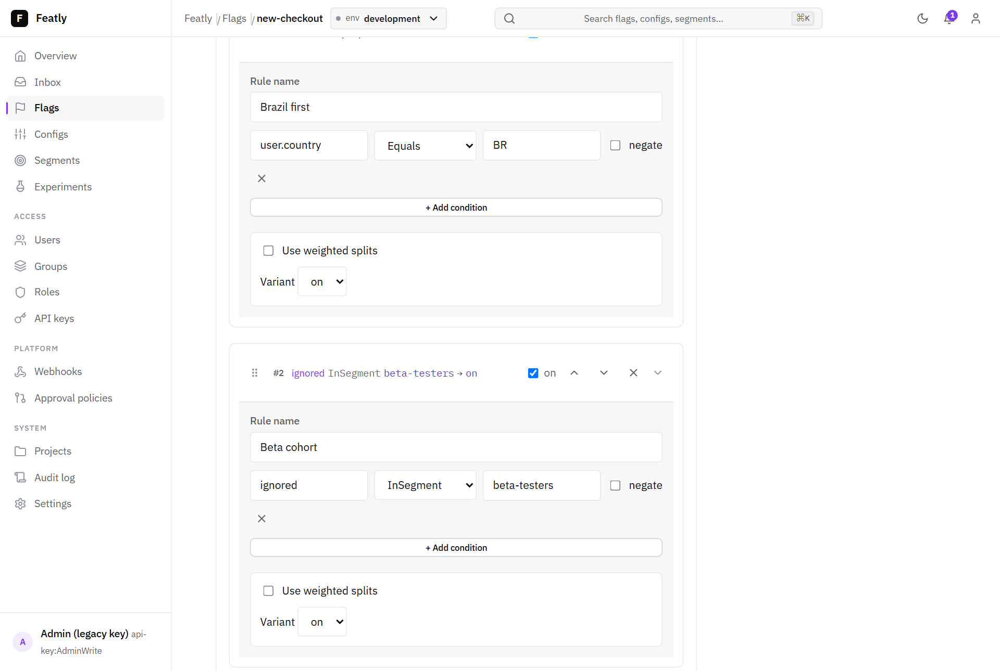

# Featly

> Feature management for .NET. Feature flags, dynamic configuration, segments, experiments, and enterprise governance. Embed the server, dashboard, and SDK inside your ASP.NET Core process like Hangfire, or host it centrally for many consumers. Bring your own database.

[](LICENSE)
[](#status)
[](https://dotnet.microsoft.com/)

---

## Status

Featly is in **early design and development**. The architecture is documented and the implementation is starting. There are no releases yet. Stars, ideas, and pull requests are welcome.

If you want to know where the project is headed, read [PLAN.md](PLAN.md). If you want to understand the design, read [ARCHITECTURE.md](ARCHITECTURE.md).

## What is Featly

Featly is what you get when you combine three things into one open-source product for the .NET ecosystem:

- **The developer experience of Hangfire.** Embed the server, dashboard, and SDK inside your ASP.NET Core process. Two registration calls and a middleware mount and you have a working feature management platform.
- **The engine model of LaunchDarkly and Unleash.** Local evaluation in the SDK, server provides configuration. Decisions take microseconds with no network call on the hot path.
- **Enterprise governance.** Custom RBAC with four seeded roles, approval workflows with per-environment policies, audit log, ReadOnly environment lock, dry-run mutations, and settings with database-overrides-config precedence.

No other project in the .NET open-source space combines these. That is Featly's niche.

## Features

- Boolean and multivariate **feature flags** with rule-based targeting
- **Dynamic typed configuration** (string, int, decimal, JSON, ...) using the same targeting engine
- **Segments** — named, reusable audience definitions
- **Experiments and A/B testing** with deterministic bucketing and exposure events
- **Projects and Environments** as first-class entities with isolation
- **Custom RBAC** — four immutable system roles (Viewer, Editor, Approver, Admin) plus user-defined custom roles, ~45 granular permissions
- **Approval workflows** with required reviewers (specific users, roles, or groups), comments, stale handling, and emergency bypass with audit
- **Audit log** of every mutation, every approval, every settings change
- **ReadOnly environment lock** for incident freezes
- **Dry-run** on any mutation endpoint
- **Webhooks** with HMAC signing for external integrations (Slack, Teams, Discord, PagerDuty)
- **OpenFeature provider** shipped as a first-class day-one feature
- **Storage**: SQLite for embedded, SQL Server and PostgreSQL planned
- **Observability**: native OpenTelemetry traces and metrics

## Dashboard

Featly ships an embedded dashboard (mount it at `/featly`, Hangfire-style) for
managing flags, configs, segments, experiments, RBAC, approvals, webhooks, and
audit — everything reachable in the UI is also reachable via the HTTP API.


A visual, collapsible rule editor builds targeting rules (conditions, operators,
segments, weighted splits) without touching JSON:



Governance is first-class: the Inbox surfaces changes awaiting your approval,
each change review shows a line-level current → proposed diff, and the audit log
records every mutation with a before/after diff.


A command palette (`Cmd`/`Ctrl`-K) jumps to any screen or searches flags,
configs, and segments:


## Three deployment patterns

The same binary supports three patterns. The schema is identical across them.

**Pattern 1 — Embedded per app, isolated database.** Your ASP.NET Core app hosts the Featly server, dashboard, and SDK in the same process. SQLite by default. Zero-friction quickstart, the Hangfire experience.

**Pattern 2 — Centralized server, SDKs point at it.** One Featly server hosted standalone, many consumers running only the SDK pointed at it. SQL Server or PostgreSQL. The LaunchDarkly / Unleash operational model.

**Pattern 3 — Embedded with shared database.** Multiple apps embed Featly and point at the same database. The Project concept keeps each service's flags isolated.

## Quick start (planned API)

Self-host inside your own ASP.NET Core app:

```csharp
// Program.cs
builder.Services.AddFeatlyServer(opts =>
{
    opts.UseSqlite("Data Source=featly.db");
});

var app = builder.Build();

app.MapFeatlyDashboard("/featly");    // UI at /featly
app.MapFeatlyApi();                    // SDK + admin endpoints
```

Consume from any .NET app:

```csharp
builder.Services.AddFeatly()
    .UseServer("https://features.mycompany.com", apiKey: "...")
    .UseContextAccessor<HttpContextFeatlyContextAccessor>();
```

```csharp
public class CheckoutController(IFeatlyClient featly) : ControllerBase
{
    public async Task<IActionResult> Start()
    {
        if (await featly.Flags.IsEnabledAsync("new-checkout-flow"))
        {
            var timeout = await featly.Configs.GetAsync<int>("checkout.timeout", 30);
            await featly.Events.TrackAsync("checkout.started");
            return Ok(new { ui = "v2", timeout });
        }

        return Ok(new { ui = "v1" });
    }
}
```

## Documentation

- [Getting started](docs/GETTING_STARTED.md) — install and your first flag in minutes
- [Configuration](docs/CONFIGURATION.md) — every setting, the three-layer precedence, environment variables, the CLI
- [Deployment](docs/DEPLOYMENT.md) — the three deployment patterns and a production checklist
- [OpenFeature](docs/OPENFEATURE.md) — adopt the vendor-neutral OpenFeature API
- [Performance](docs/PERFORMANCE.md) — evaluation benchmarks and targets
- [Security audit](docs/SECURITY_AUDIT.md) — the v0.1.0 security review
- [Architecture](ARCHITECTURE.md) — full architectural design, evaluation engine, contracts, APIs, [ADRs](docs/adr/)
- [Implementation plan](PLAN.md) — milestones, ordering, current focus
- [Contributing](CONTRIBUTING.md) — how to contribute code or ideas
- [Security](SECURITY.md) — how to report vulnerabilities

## Comparison

| Capability | Featly | Microsoft.FeatureManagement | Unleash OSS | Flagsmith | LaunchDarkly |
|---|---|---|---|---|---|
| Server + UI + SDK embedded in your .NET app | Yes | No | No | No | No (SaaS) |
| Self-hosted with SQLite | Yes | n/a | No | Partial | No |
| Dynamic configs with full targeting | Yes | No | Partial | Yes | Yes |
| Experiments + A/B | Yes | No | Partial | Yes | Yes |
| Approval workflow + custom RBAC | Yes | No | Enterprise tier | Partial | Yes |
| OpenFeature provider | Yes (day one) | Via third-party | Yes | Yes | Yes |
| First-class .NET ecosystem | Yes | Yes | Partial | Partial | Partial |
| Open source + free self-host | Yes | Yes | Yes | Yes | No |

## License

[MIT](LICENSE).

## Notice

Featly is unrelated to other projects, companies, or applications that may share the name. See [NOTICE.md](NOTICE.md) for details.
