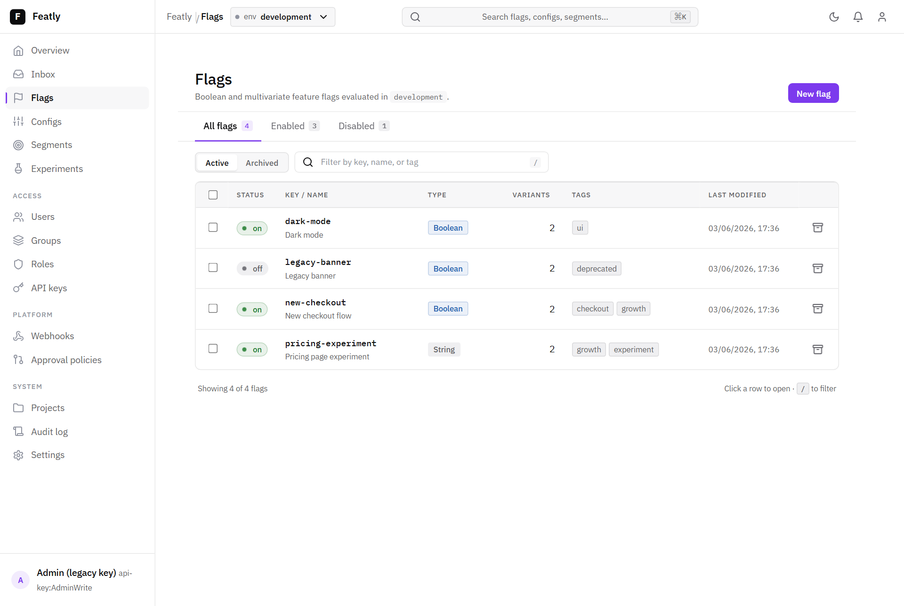
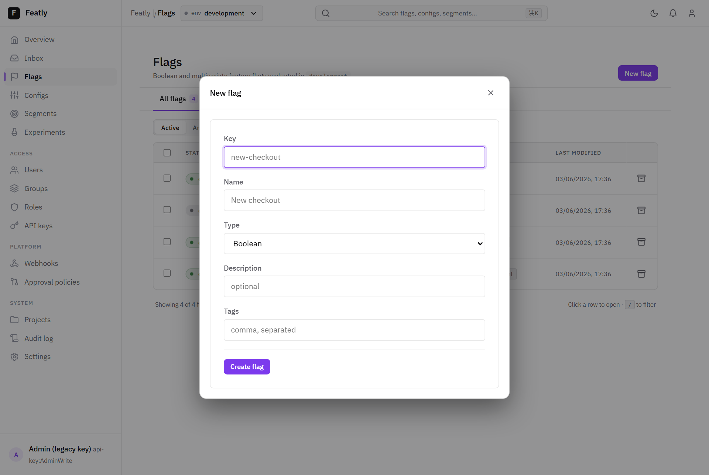
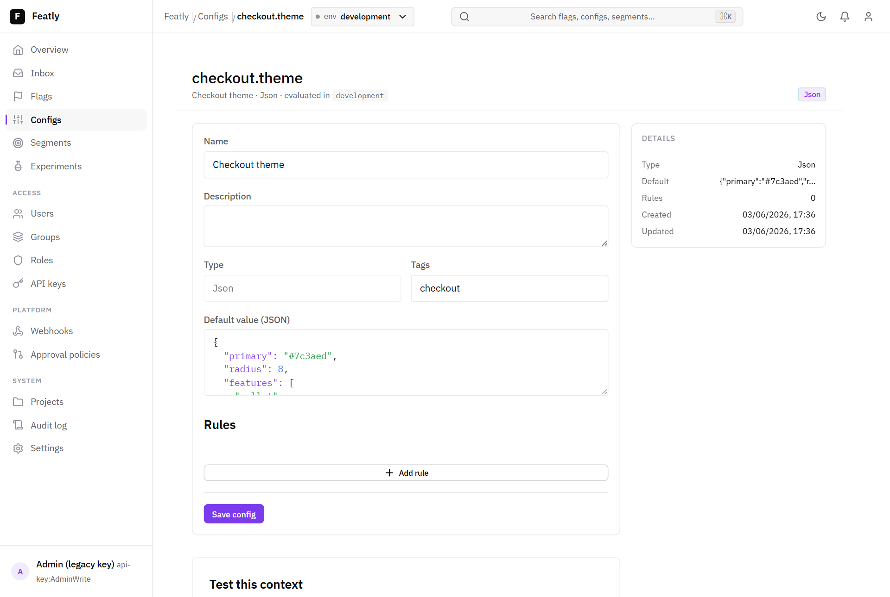
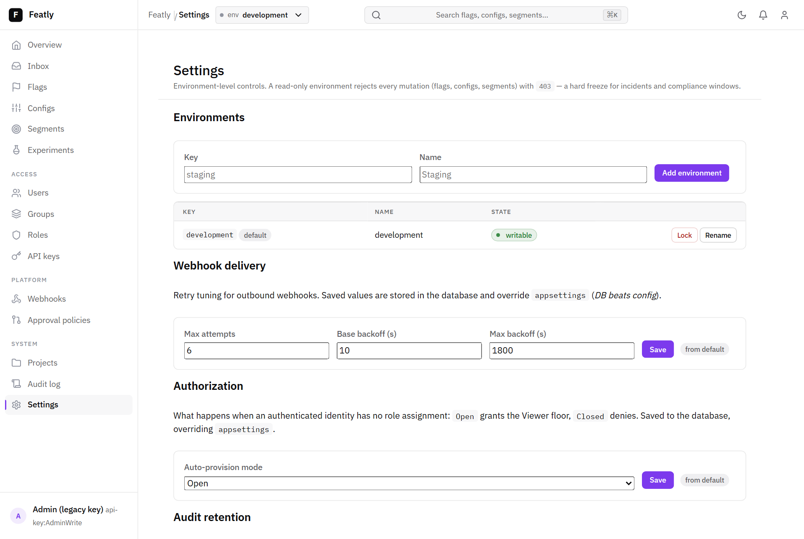
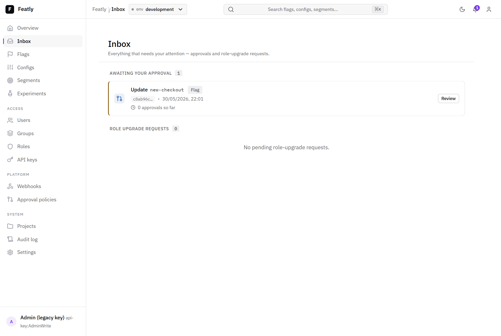
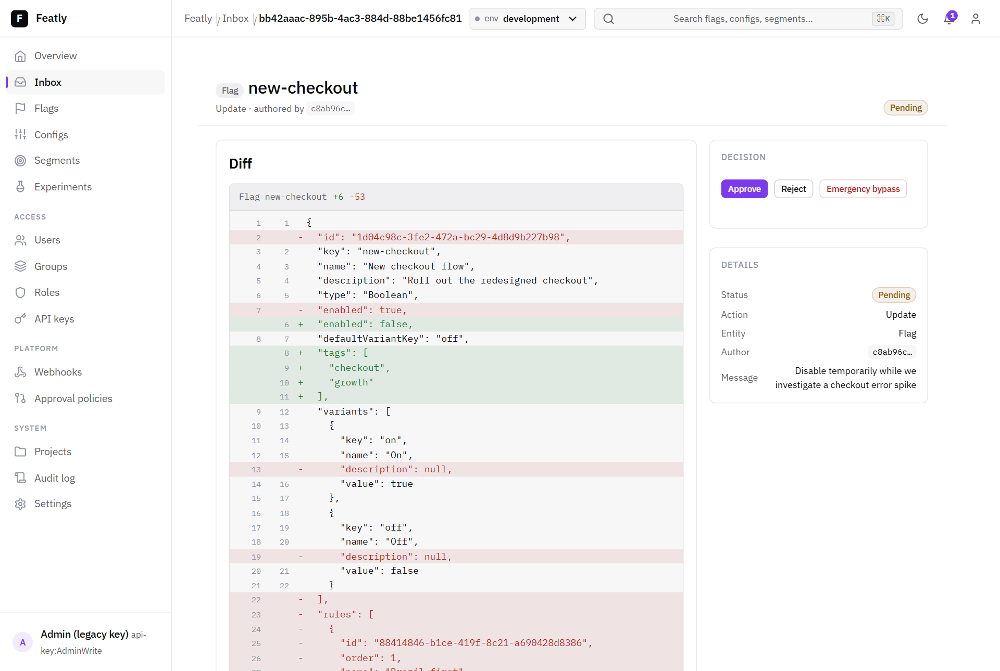
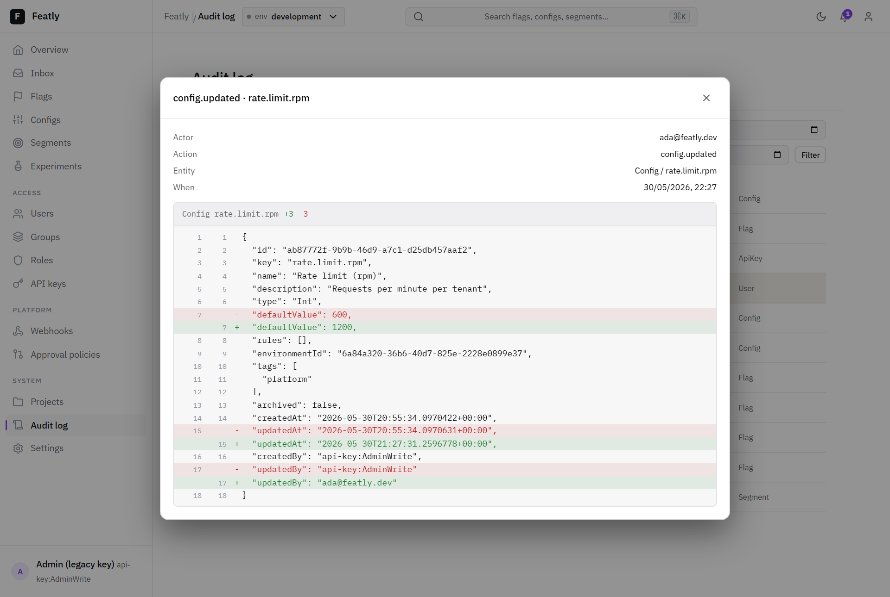
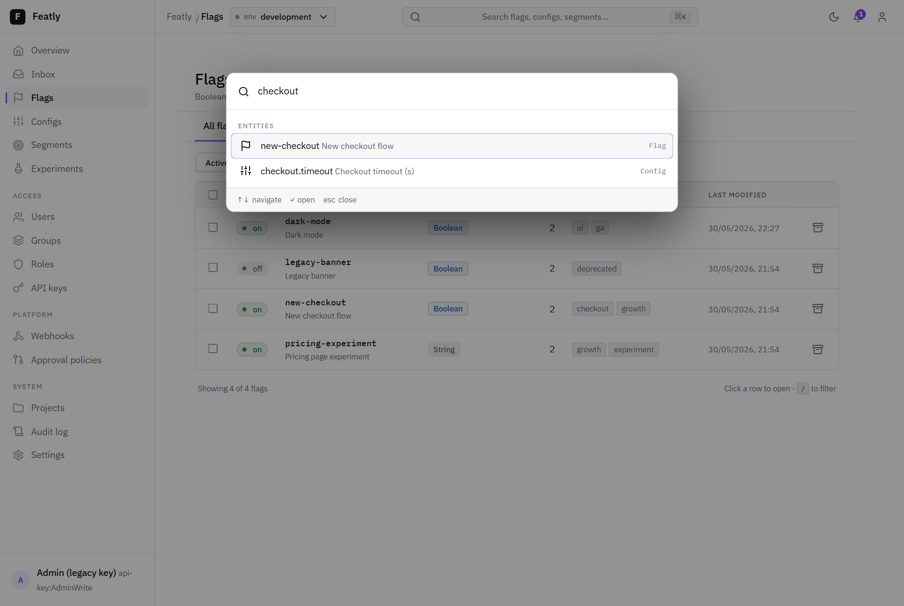

Featly ships an **embedded dashboard** — mount it at `/featly`, Hangfire-style,
and you have a full management UI for flags, configs, segments, experiments,
RBAC, approvals, webhooks, and audit. Everything reachable in the UI is also
reachable via the HTTP API.

The shell has a left nav grouped by area (flags / configs / segments /
experiments, access, platform, system), breadcrumbs, an environment pill, a
light/dark toggle, and a command palette.

## Flags

The **Flags** screen lists every flag with status, type, variants, tags, and
last-modified, with quick filters and a tab split by enabled / disabled.

## Creating things

**New flag** — and the equivalent on Configs and Segments — opens a quick create
modal that seeds a valid entity and drops you straight into its editor.

## The visual rule editor

Opening a flag gives you the editable detail plus a **visual rule editor**: each
rule is a collapsible card of AND-ed conditions (attribute, operator, value,
optional segment) resolving to a variant or a weighted split — no JSON required.

## The JSON editor

JSON-typed values (a `Json` flag variant or config value) use a
**syntax-highlighted editor** that validates and pretty-prints as you type.

## Settings

The **Settings** screen edits runtime settings with *database-overrides-config*
precedence — webhook retry tuning, the auto-provision policy, audit retention,
approval defaults, and request rate limiting. Each setting shows whether its
effective value comes from the **database** or `appsettings`. The same screen
lists each environment with its lock state and connected SDK clients + last
config sync (best-effort, in-process — see
[Deployment](/Featly/operate/deployment/#scaling-out-one-writable-replica-for-now)
for the multi-replica caveat).

## Approvals — the Inbox

When an environment requires approval, mutations become **pending changes**. The
**Inbox** collects what needs your attention — approvals and role-upgrade
requests.

Reviewing a change shows a line-level **current → proposed** diff before you
approve or reject it.

## Audit log

Every mutation is recorded in the **Audit log**; clicking an entry opens a
before/after diff.

## Command palette

Press `Cmd`/`Ctrl`-K anywhere to open the **command palette** — jump to a screen
or search flags, configs, and segments by key or name.

## Next

- [Getting started](/Featly/getting-started/) — stand the dashboard up locally.
- [Governance](/Featly/concepts/governance/) — the model behind approvals, RBAC, and
  the audit log.
- [Modularity](/Featly/operate/modularity/) — disabled feature areas disappear from
  this nav automatically.
